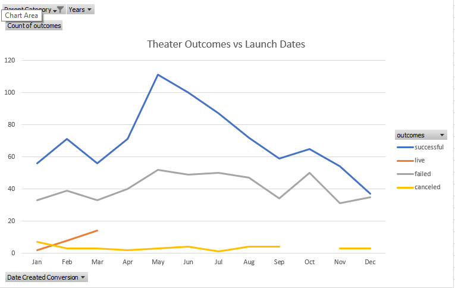
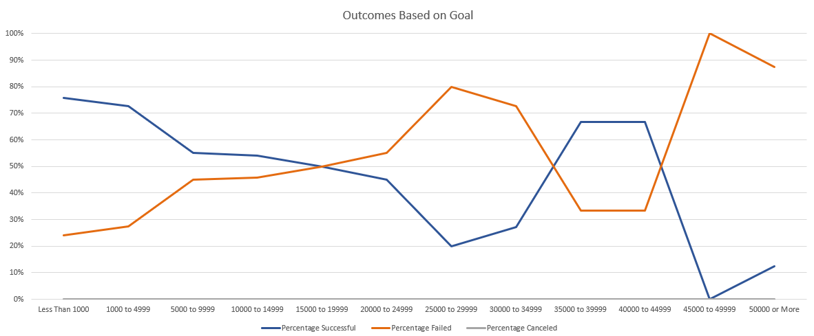
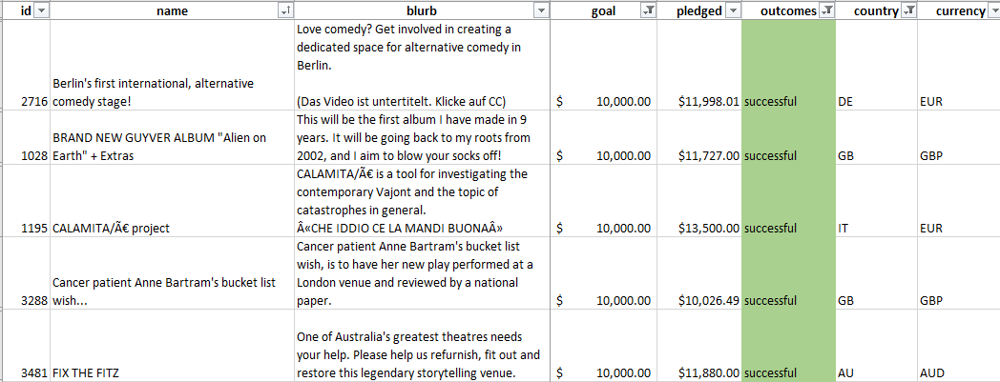

# Kickstarting with Excel

## Overview of Project
An analysis of recent Kickstarter projects was performed at the request of client, Louise. The client, based in Great Britain, states that they plan to launch a Kickstarter to fund a play titled “Fever.” Analysis and recommendations around the timing, levels, and type of Kickstarter were completed using data publicly available from the Kickstarter site.
The purpose of this analysis is to assist the client in determining the most successful time to launch her Kickstarter, an ideal monetary goal based on her estimated costs while optimizing chances of success, and a general overview of similar projects.

## Analysis and Challenges
Data scraped from Kickstarter included project descriptions, financial goals and receipts, launch and close dates, geographic origin, and outcomes. The data set analyzed is limited to projects started between May of 2009 and March of 2017.
Several challenges are presented by the data set, including the self-reporting nature of much of the information and the wide variety of projects and their potential backing audience. 

## Results

### Analysis of Outcomes Based on Launch Date
The numbers of successful and failed theater Kickstarter trend generally together month by month. However, the largest gap increasing chances of success seem to be for those launched in May, while the largest gap increasing the chances of failure occurs for Kickstarters launched in October.

### Analysis of Outcomes Based on Goals
Levels of success appear highest for Kickstarters with goals under $5,000 or between $35,000 and $40,000. For the level planned by the client (approximately $10,000), successes are more likely than failures.

### Challenges and Difficulties Encountered
While the data examined provided a fairly comprehensive picture of Kickstarter projects within the specified time frame, some limitations remain. The data set’s provenance and method of creation is unknown, meaning there may have been other pieces of information excluded without the knowledge of the analyst. One particular unknown is the currency conversion process. Specifically, whether the currencies listed have all been converted to US Dollars or remain in quantities in their own currency. The number of goals in currencies other than USD that are round numbers (i.e. 5,000, 10,000, etc.), leads the analyst to believe that these numbers actually represent the amount in the original currency, which may throw off all analysis based on goals. 

#### Examples of Goals in Currencies other than USD

Furthermore, outcome information based on launch date and goals has not been controlled for the sample size, which may lead to an outsized estimation of the reliability of data overall.

### Future Analysis Recommendations
Additional future analyses of interest may include an examination of the length of the Kickstarter from launch to close or an examination of the level of boost received from being featured as a spotlight or staff pick.   

